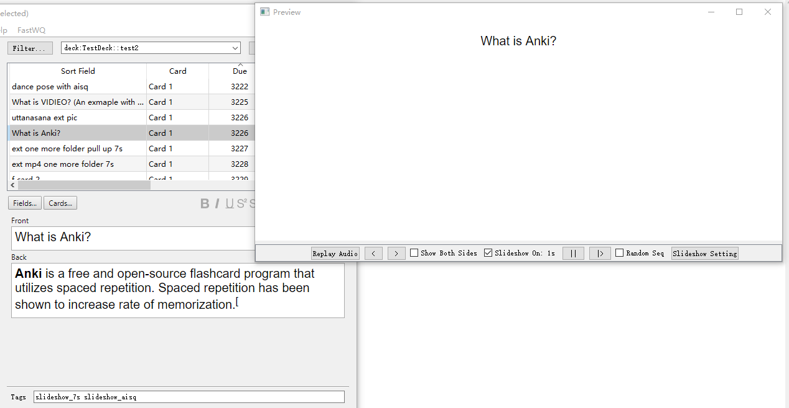
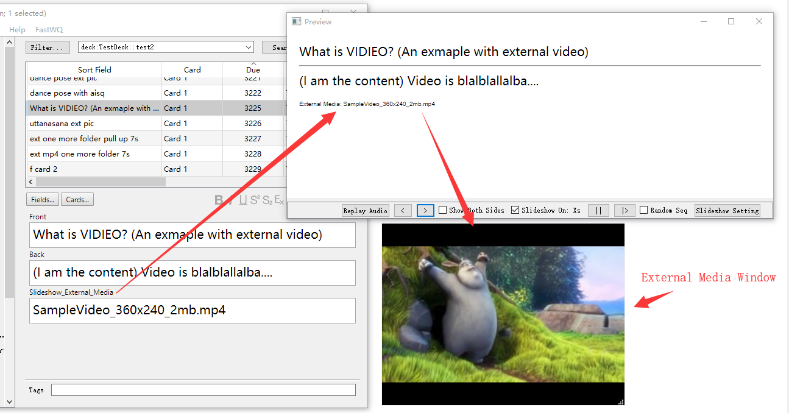

# anki-preview-slideshow

**Make Anki preview window as slideshow. For each card, it also introduce a media window to show external media files(not stored in Anki DB) like mp4, mp3, jpg, etc. External media window can be disabled, of course.**

## Quick Start Guide:
0. Installation: https://ankiweb.net/shared/info/90397199
1. Click "Browse" -> on Browser window, select target deck or filter out desired cards
2. Click "Preview" to open preview slideshow window
3. Click "Slideshow on/off" to check the box and start slideshow

## Instructions:

1. Check/Uncheck "Slideshow On/Off" to start/stop slideshow
2. Check/Uncheck "Random Seq" to activate/disable random sequence
3. Click "||" button to pause slideshow
4. Click "|>" button to continue slideshow or go to next slide
5. Use tag like "slideshow_Xs" to indicate showing answer for X seconds
   (no time tag for question)
   for example, "slideshow_17s" for 17 seconds
6. Use tag "slideshow_aisq" to indicate question slide is same with answer slide and answer slide should be skipped.
7. To show external media like mp4, jpg, gif.
   a. Create a field in exact name "Slideshow_External_Media"
   b. Put the file path for the external media file there like "D:/somefolder/myvideo.mp4"
   c. Root forder can also be set in settings. Like setting it to "D:/somefolder"
      then "Slideshow_External_Media" field can work in relative path like "myvideo.mp4", "sometype/blabla.png"
   d. With root folder set, if you want to use absolute path accassion occasionally,
      put "$$" before the path, like "$$D:/somefolder/myvideo.mp4"
8. A trick: to align buttons in preview window left, open preview window, resize it to a very small one, reopen it
9. Hover over buttons to see tooltips

## Source Code

1. Source code can be found on https://github.com/tosimplicity/anki-preview-slideshow
2. This add-on is licensed under GPL v3, or higher

## Version History

Version 0.2
- Make it compatible with Anki 2.1.24+
- add absolute path marker support while root folder set

Version 0.1
- Initial release
